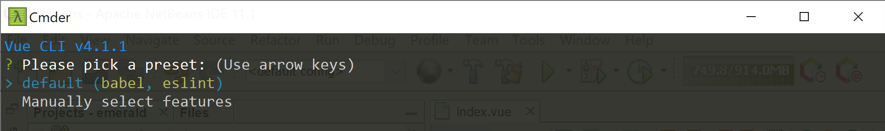
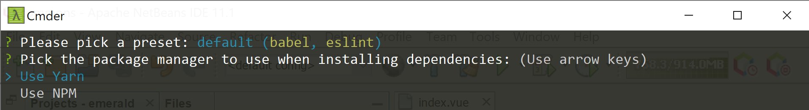
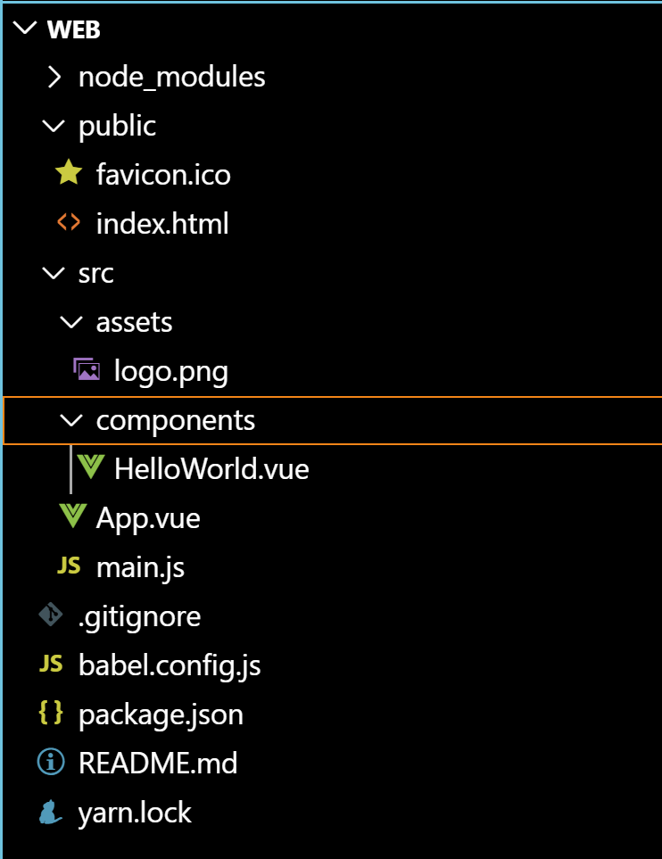

# เรียนรู้ Vue.js

> https://cli.vuejs.org/guide/  

# Install  

### 1. Install Vue CLI

ดู npm (node package manager) version ในเครื่อง
```sh
$ npm --version
6.11.3
```
ติดตั้ง @vue/cli
```sh
$ npm install -g @vue/cli
```
ดู vue version
```sh
$ vue --version
@vue/cli 4.1.1  
```
### 2. Create Project

```sh
$ vue create <PROJECT_NAME> 
```
? Please pick a preset : เลือกเป็น default  



? Pick the Package Manager : เลือกเป็น YARN 



### 3. Run 

```sh
$ cd <PROJECT_NAME>  
$ yarn serve 
```

ลองเข้า http://localhost:8080/    

# Project Structure  


