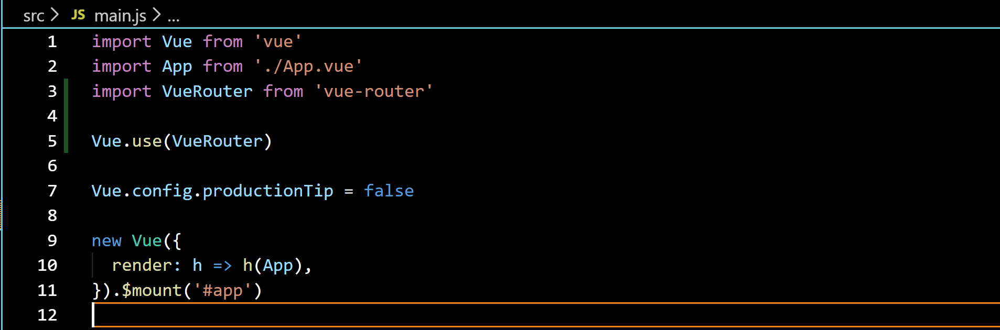
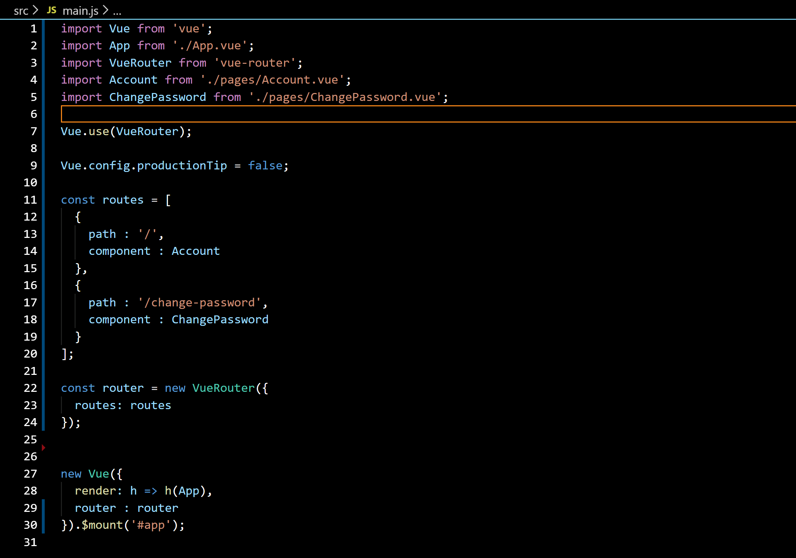
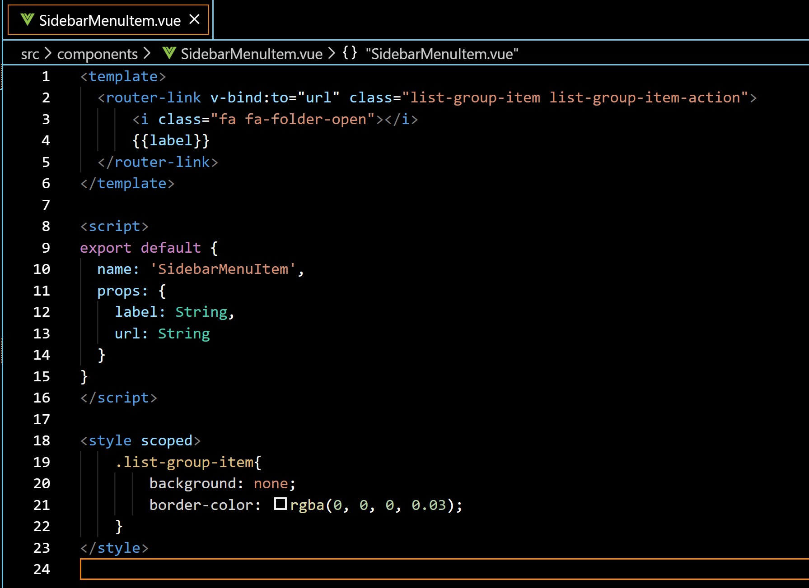
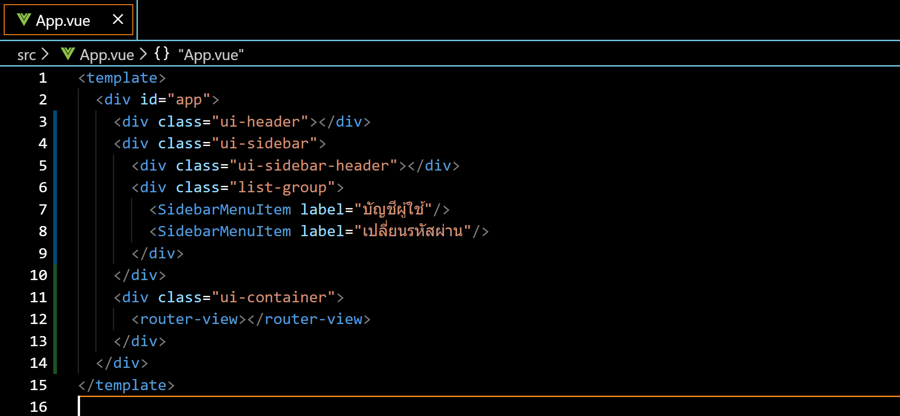

# การใช้งาน Vue Router

# Install

### 1. Install
```sh
$ npm install vue-router  
```

### 2. ใช้ Router

ที่ไฟล์ main.js ให้ 
```js
...
import VueRouter from 'vue-router'
Vue.use(VueRouter)
...
```
  


### 3. Config Route

ที่ไฟล์ main.js ให้ 
```js
...
const routes = [
  {
    path : '/', 
    component : <YOUR_COMPONENT>
  },
  {
    path : '/change-password', 
    component : <YOUR_COMPONENT>
  }
];

const router = new VueRouter({
  routes: routes
});
...
new Vue({
  render: h => h(App),
  router : router /* add router */
}).$mount('#app');
```



### 3. กำหนด Router Link

```html
<router-link to="<FIXED_ROUTE_PATH>">Go to Foo</router-link>
```
หรือ 
```html
<router-link v-bind:to="">Go to Foo</router-link>
```



### 4. กำหนด Router View 

ที่ไฟล์ App.vue 
```vue
<template>
    ...
    <router-view></router-view> 
    ...
</template>
...
```

